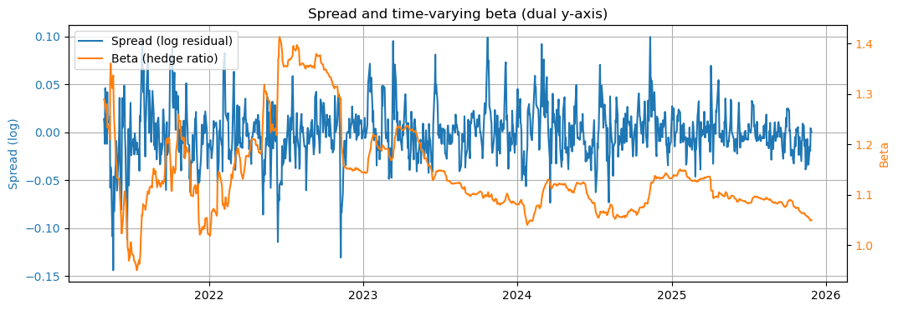
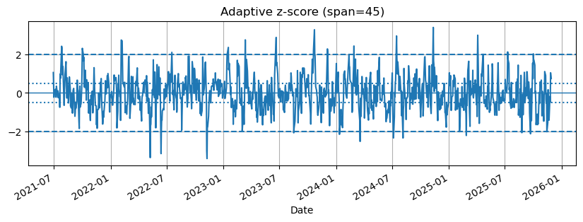

# BTC–QQQ Pairs / Spread Analysis (Kalman Hedge Ratio + Adaptive Z-Score)

A compact research project to reinforce quantitative time-series knowledge by analyzing the relationship between **BTC-USD** and **QQQ** across **prices** and **returns** using a pairs/spread modeling approach.

## What this repository demonstrates

- Correct handling of **calendar mismatch** (BTC trades 24/7 vs QQQ session-based) via explicit alignment.
- Spread construction as a **regression residual** in **log-price space**.
- **Time-varying hedge ratio** estimation using a lightweight **Kalman filter**.
- **Adaptive z-score** (EWM mean/std) with event-based statistics (frequency and duration).
- Stationarity and dynamics diagnostics: **ADF/KPSS**, **half-life**, and **autocorrelation**.

### Notes and limitations

This repository focuses on analysis and diagnostics. A production-grade trading system would additionally require:

- transaction costs and slippage modeling

- position sizing and risk constraints (e.g., beta- or volatility-neutral sizing)

- walk-forward validation and regime filters

- execution assumptions consistent with the target venue and frequency

## Methods (high-level)

### Data alignment
Close prices are aligned with `align="inner"` to avoid forward-filling session-market prices across weekends, which can distort returns and spread dynamics when mixing 24/7 and session-based assets.

### Model (log-price space)
Let:
- \(Y_t\): BTC-USD close price
- \(X_t\): QQQ close price
- \(y_t = log(Y_t)\), \(x_t = log(X_t)\)

The core relationship is modeled as:

\[
y_t = alpha_t + beta_t * x_t + varepsilon_t
\]

- \(beta_t\) is the **hedge ratio** (estimated dynamically).
- \(varepsilon_t\) is the **spread** (residual).

### Time-varying hedge ratio (Kalman filter)
A simple state-space model is used to estimate \(alpha_t\) and \(beta_t\) over time, allowing the hedge ratio to adapt to regime changes.

### Adaptive z-score
An adaptive z-score is computed from the spread:

\[
z_t = frac{varepsilon_t - mu_t}{sigma_t}
\]

with \(mu_t\) and \(sigma_t\) estimated via exponentially weighted mean/std (EWM), controlled by `ZSPAN`.

### Event parsing
Signal “events” are defined as:
- Entry when \(|z| > 2\)
- Exit when \(|z| < 0.5\)
Event statistics include:
- events per 1000 bars
- time spent beyond the entry threshold
- duration distribution (mean/median/p90)
- LONG vs SHORT counts

## Results snapshot (example from the notebook)





- **Stationarity**: ADF strongly rejects unit root; KPSS does not reject stationarity.
- **Mean reversion speed**: half-life on the order of ~1–2 daily bars.
- **Z-score behavior**: moderate-frequency extreme events with typical durations of a few bars, depending on `ZSPAN` and thresholds.

Exact values depend on sample period and parameters; the notebook produces reproducible outputs.

## Repository structure

Cross_assets_pair_analyzer

```text
.
├── pyproject.toml
├── README.md
├── PROJECT_BRIEF.md
├── src/
│   ├── __init__.py
│   └── core.py
├── notebook/
│   └── analysis_pairs.ipynb
├── scripts/
│   └── download_data.py
└── assets/
    ├── beta_spread.png
    └── zscore.png
```


## Instalation

Create a virtual environment and install the project in editable mode:

```bash
python -m venv .venv
# Windows:
#   .venv\Scripts\activate
# macOS/Linux:
#   source .venv/bin/activate

pip install -U pip
pip install -e ".[research]"
```

## Usage (in a notebook)

```python
import src.core as core

closes = core.load_and_prepare_closes("data/raw/prices.csv", align="inner")
log_prices = core.compute_log_prices(closes)

k = core.kalman_hedge_ratio(log_prices, "BTC-USD", "QQQ")
z = core.zscore_ewm(k["spread"], span=60)
```

## Reproducible demo

If you want the notebook to run out-of-the-box, you can download a small dataset locally:

```bash
pip install -e ".[research]"
python scripts/download_data.py --tickers BTC-USD QQQ --start 2024-01-01 --end 2025-01-01
```

This will write `data/raw/prices.csv` (excluded from git by default).


